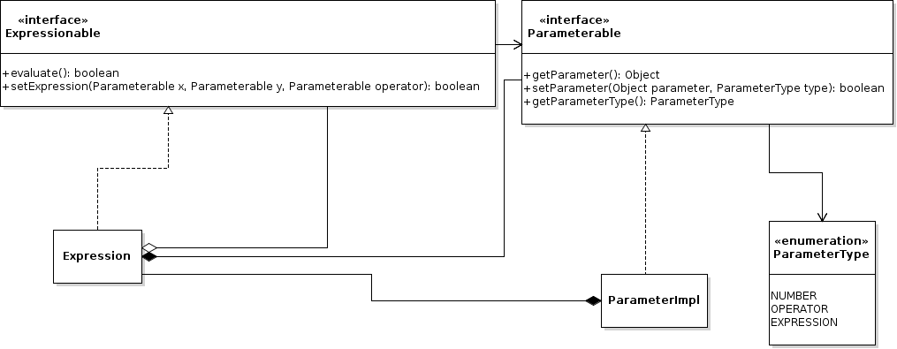
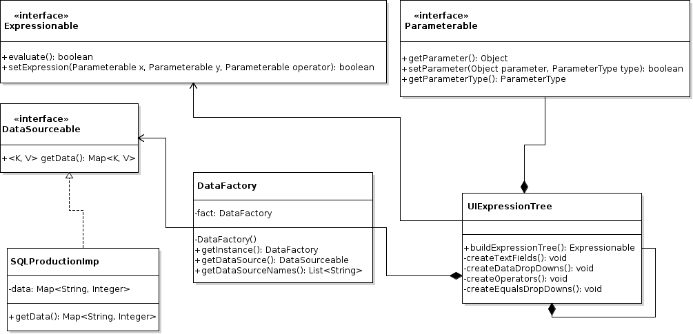

# Expression Engine
Ross Byrne and Christy Madden's main 4th year project.

# Introduction
The expression engine is an expression builder. It allows users to build any expression with the use of the AND, OR, >, < and Equals operators. The data used in the expressions can be pulled from any data source provided they are implemented. Currently, the values that are evaluated are positive and negative decimal and integer values. Once the expression is built, the user can select to run a command. The user can choose whether they want to the command to run if the expression evaluates as either True or False.

# Instructions
The project is in an IntelliJ IDEA project solution. For more on IntelliJ IDEA, see [here](https://www.jetbrains.com/idea/). The project has been developed with Java 8 and JavaFX. To compile the source code, the Java 8 JDK is required. JavaFX comes bundled with the Java 8 JDK. For Oracle's Java 8 JDK, see [here](http://www.oracle.com/technetwork/java/javase/downloads/jdk8-downloads-2133151.html). 

The source code can be run by compiling and running Main.java in the package ie.gmit.sw. This will start the application.

To compile the source code from the terminal or command line, navigate to the src folder and run:
```
javac ie/gmit/sw/*.java
```
To start the application, run:
```
java ie.gmit.sw.Main
```
# Design
The design of the application comes down to three main sections. The expression binary tree, the UI binary tree and the command objects.

## The Expression Binary Tree

A UML diagram of the expression binary tree that creates and evaluates expressions:



## The UI Binary Tree

A UML diagram of the binary tree that builds the UI elements for the user as they create their expression and then creates the expression binary tree based on what the user created. Also includes the factory for retrieving the data that is used in the expression.



## The Command Objects


 
